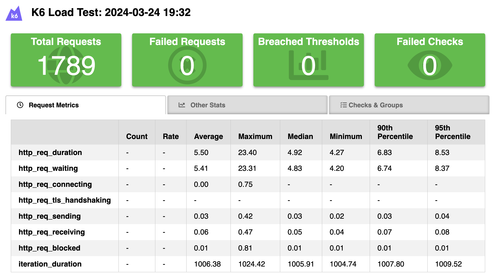
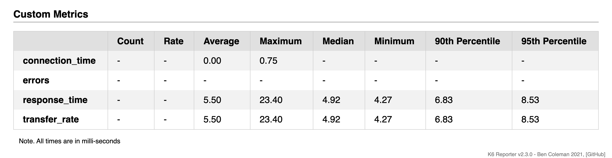

# testes com K6
- Os testes de carga aqui documentados foram desenvolvidos junto com o Bruno Meira, visto que realizamos esses testes como parte do entregável do projeto na sprint 4. Logo, os testes são os mesmos, mas a realização da documentação e conceitos aprendidos foi feita de forma individual.
- Endpoint escolhido: POST de distribuições
## 1. Tecnologias utilizadas
- K6:
  - Ferramenta utilizada para a realização de testes de carga
  - Possibilita a simulação de tráfego HTTP para avaliar o desempenho dos endpoints do projeto desenvolvido.
## 2. Conceitos apendidos
### Testes de carga
- Os testes de carga são uma forma de avaliar o desempenho do sistema desenvolvido sob diferentes condições de cargas, de forma simulata.
- Eles conseguem simular como se X usuários estivessem fazendo requisições em um X período de tempo, de forma simultânea, algo que seria inviável de testar manualmente, com carga humana.
- Os principais objetivos são:
  - identificar os limites operacionais do sistema;
  - detectar gargalos de desempenho;
  - garantir que a aplicação possa lidar com sua carga prevista de forma eficiente e confiável.
### Resultados e Relatório gerado
- Foi utilizado a ferramenta K6 HTML Report Exporter para gerar um relatório visual com os resultados dos testes desenvolvidos.
- Docs completa da API utilizada: https://github.com/benc-uk/k6-reporter

